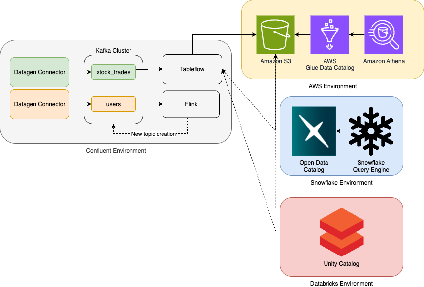

# Tableflow Terraform Demo

This project contains Terraform scripts to provision and configure a modern data pipeline using Confluent Cloud, AWS, and (optionally) Databricks and Snowflake. It automates the creation of Kafka topics, IAM roles, S3 buckets, and all necessary integrations for Tableflow and streaming analytics.

## Overview

This Terraform project will:
- Create and configure Confluent Cloud environments, Kafka clusters, topics, and API keys.
- Set up AWS S3 buckets and IAM roles for secure data storage and access.
- Integrate with Databricks and/or Snowflake for downstream analytics (optional).
- Provision sample data generators and schema registry resources.
- Manage all resources as code for easy reproducibility and teardown.

## Architecture



## Prerequisites

- **Confluent Cloud Account**: Sign up at https://confluent.cloud/ if you don’t have one.
- **AWS Account**: Sign up at https://aws.amazon.com/ if you don’t have one.
- **Terraform**: Install Terraform (v1.0 or newer) from https://developer.hashicorp.com/terraform/downloads
- **AWS CLI**: Install from https://docs.aws.amazon.com/cli/latest/userguide/getting-started-install.html

### Initial Setup

1. **Configure AWS CLI**  
   Run:  
   ```sh
   aws configure
   ```
   Enter your AWS Access Key, Secret Key, region, and output format.

2. **Get Confluent Cloud Credentials**  
   - Log in to Confluent Cloud.
   - Create an API Key and Secret for your environment (see Confluent Cloud documentation).

3. **Clone this repository**  
   ```sh
   git clone <your-repo-url>
   cd tableflow-project
   ```

## Required Variables

You can provide variables in a `terraform.tfvars` file (recommended), or set them as environment variables.

### Confluent Cloud
- `confluent_cloud_api_key` (string): Your Confluent Cloud API Key
- `confluent_cloud_api_secret` (string, sensitive): Your Confluent Cloud API Secret

### Environment
- `environment_display_name` (string): Name for your Confluent environment (e.g., "My Tableflow Demo")

### Catalog Types
- `catalog_types` (list(string)): Which integrations to enable. Example: `["databricks", "snowflake"]`

### AWS
- `aws_region` (string): AWS region (e.g., "us-east-1")

### Snowflake (optional, for Snowflake integration)
- `snowflake_endpoint` (string): Snowflake endpoint URL
- `snowflake_warehouse` (string): Snowflake warehouse name
- `snowflake_allowed_scope` (string): Allowed scope for Snowflake integration

### Polaris (optional, for Snowflake Open Data/Polaris integration)
- `polaris_client_id` (string): Polaris Client ID
- `polaris_client_secret` (string): Polaris Client Secret
- `polaris_account_name` (string): Polaris account name
- `polaris_username` (string): Polaris username
- `polaris_password` (string): Polaris password
- `polaris_region` (string): Polaris region

### Databricks (optional, for Databricks integration)
- `databricks_workspace_id` (string): Databricks workspace ID
- `databricks_workspace_name` (string): Databricks workspace name
- `databricks_account_id` (string): Databricks account ID
- `databricks_host` (string): Databricks workspace host URL
- `databricks_token` (string): Databricks workspace token
- `databricks_sql_warehouse_name` (string): Databricks SQL warehouse name
- `databricks_client_id` (string): Databricks OAuth client ID

## How to Run

1. **Initialize Terraform**
   ```sh
   terraform init
   ```

2. **Review the Plan**
   ```sh
   terraform plan
   ```

3. **Apply the Configuration**
   ```sh
   terraform apply -auto-approve
   ```
   - This will provision all resources without prompting for confirmation.

4. **Check Outputs**
   - Terraform will print important outputs (API keys, S3 bucket names, etc.) after a successful run.

## Outputs

- `confluent_environment_id`: The ID of the Confluent Cloud environment.
- `kafka_cluster_ids`: Map of all Kafka cluster IDs, keyed by cluster name.
- `kafka_rest_endpoints`: Map of all Kafka cluster REST endpoints, keyed by cluster name.
- `iam_role_names`: Map of all IAM role names created, keyed by cluster name.
- `iam_role_arns`: Map of all IAM role ARNs created, keyed by cluster name.
- `s3_bucket_names`: Map of all S3 bucket names created, keyed by cluster name.
- `tableflow_topic_ids`: Map of Tableflow topic IDs, keyed by cluster name.
- `tableflow_topic_names`: Map of Tableflow topic display names, keyed by cluster name.
- `tableflow_topic_statuses`: Map of Tableflow topic statuses, keyed by cluster name.
- `provider_integration_role_arns`: Map of provider integration IAM role ARNs, keyed by cluster name.
- `provider_integration_external_ids`: Map of provider integration external IDs, keyed by cluster name.
- `provider_integration_internal_ids`: Map of provider integration internal IDs, keyed by cluster name.

## Notes

- All sensitive variables (API secrets, tokens, passwords) should be kept secure and never committed to version control.
- The project supports multiple catalog integrations; enable only those you need via `catalog_types`.
- For more details, see the comments in each `.tf` file.

---

If you have questions, please refer to the Confluent Cloud and Terraform documentation, or open an issue in this repository.


# Future Iterations
[✔️] Implement Databricks External Location Integration
[✔️] Customized Catalog Integrations for Demos
[✔️] Everything launched in a single Environment
[  ] All catalogs integrated with one catalog (Pending Terraform Support)
[  ] Finalize Unity Catalog Integration (Pending Terraform Support)
[  ] Leverage Snowflake External Database Linking


# Contributing
If you would like to contribute to this repository, please fork and submit a pull request with your suggested changes.


